# Задание

Чтобы заниматься реализацией новых продуктов, которые основаны на данных, необходимо системно решить проблему хранения конфиденциальных данных и управления ими. Сейчас данные лежат в непосредственной близости к пользователям, поэтому существует риск утечки данных и неправомерного использования информации.

Чтобы защитить данные, используйте механизмы, инструменты и принципы работы с конфиденциальными данными, например, подходы Privacy By Design, Data Minimization и Data Lineage.

В рамках этого задания вам нужно проанализировать состояние As-Is, чтобы впоследствии приступить к его доработке.

## Что нужно сделать

1. **Выявите конфиденциальные данные, которые не учтены во внутренних системах.**
    - Проанализируйте информацию о компании.
    - Создайте диаграммы потоков данных (Data Flow Diagrams). Для каждого процесса создайте отдельную диаграмму.
    - Отобразите на них, как данные перемещаются по системам компании и какие операции над ними совершают.
2. **Проведите аудит мер по обеспечению безопасности данных.**
    - Сопоставьте процессы в компании с требованиями по обеспечению безопасности данных и архитектурными практиками в области безопасности конфиденциальных данных.
    - Составьте список проблемных зон и сохраните его в отдельный документ.
3. **Подумайте, что можно улучшить.**
    - Составьте список данных для защиты и проставьте для каждого способы защиты — шифрование, обфускация, обезличивание.
    - Разработайте механизм тегирования данных с использованием инструментов тегирования.
    - Составьте список инструментов, способов и мер, которые позволят обеспечить конфиденциальность данных в указанных потоках.
    - Доработайте диаграммы из предыдущего шага: отобразите на них, что следует использовать на каждом этапе потока.

При работе над диаграммами потоков данных ориентируйтесь на рекомендации, которые мы дали в уроке «Как управлять потоками данных», и [гайд от Lucidchard](https://www.lucidchart.com/blog/data-flow-diagram-tutorial).

Когда задание будет готово, загрузите диаграммы потоков данных и список проблем в директорию Task1 в рамках пул-реквеста.

# Решение

## Пункт 1

Общий список данных:
- Данные пациента
    - Ф. И. О., дату рождения, телефон и электронную почту
    - Доп. данные: 
        - Адрес прописки, 
        - Место работы, 
        - место учебы, 
        - Хронические заболевания
- Финансовые данные: платежи пациентов, доходы и расходы компании 
- Медицинские карты пациентов
- Результаты анализов пациентов
- Данные по товарно-материальным ценностям (ТМЦ)
- Кадровые данные сотрудников: Ф. И. О., должность, зарплата, больничные, реквизиты для выплат
- Учетные данные (Active Directory)
- Технически данные (логи)

Процессы:
- Регистрация пациента в системе (заключение клиентского договора)
- Запись пациента к специалисту
- Просмотр и редактирование журнала записей к специалисту
- Оплата за медицинские услуги
- Прием пациента
- Учет ТМЦ
- Процессинг платежей и выплата налогов

**Data flow diagrams:**

Заключение клиентского договора
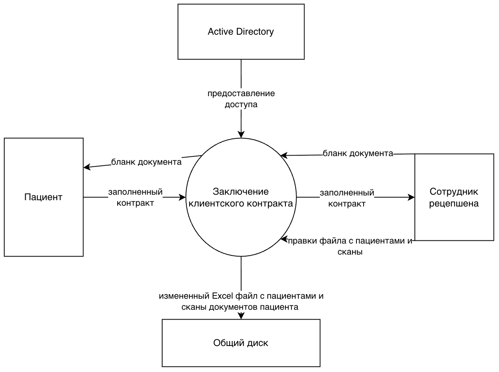

Запись пациента к специалисту
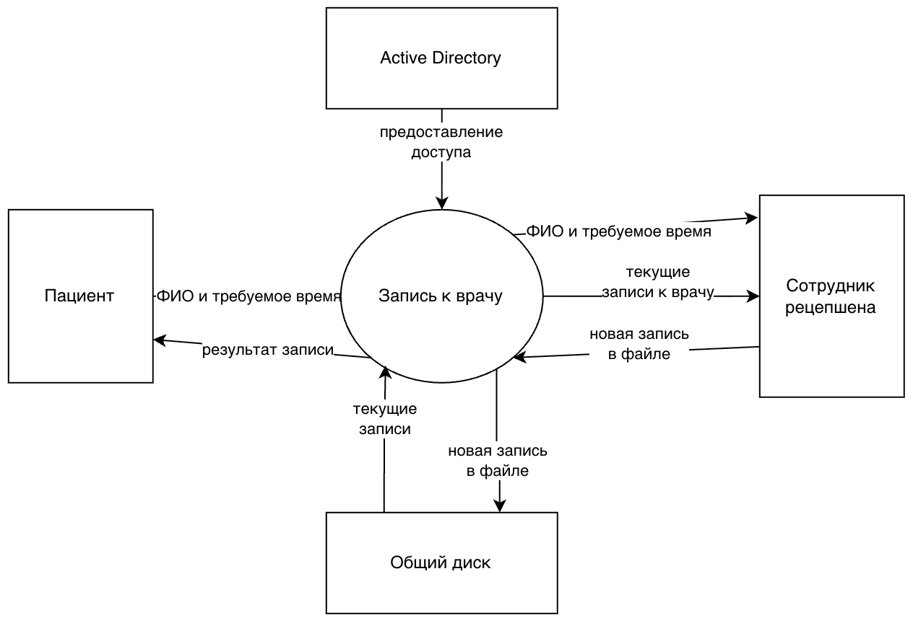

Просмотр и редактирование журнала записей к специалисту
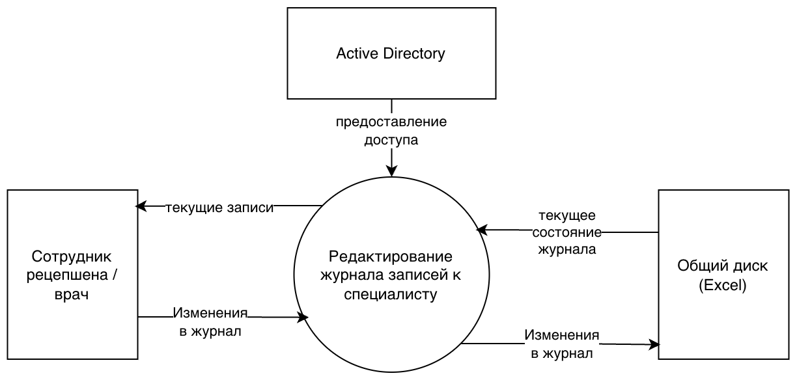

Оплата за медицинские услуги
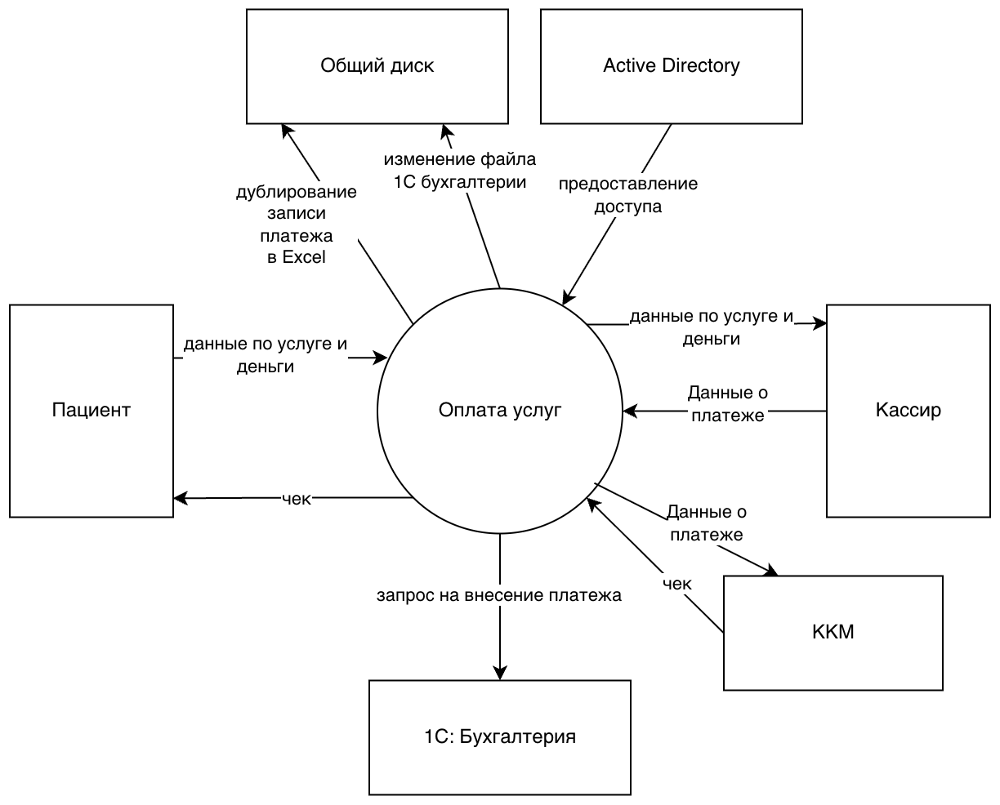

Прием пациента
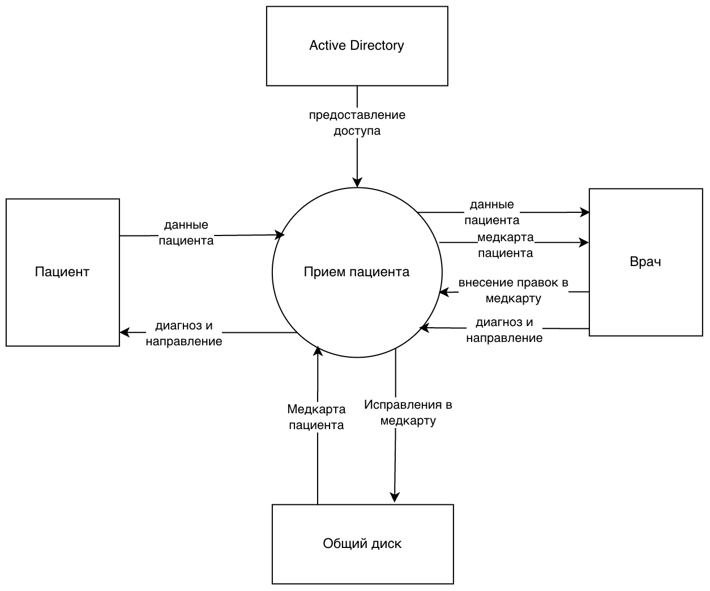

Учет ТМЦ
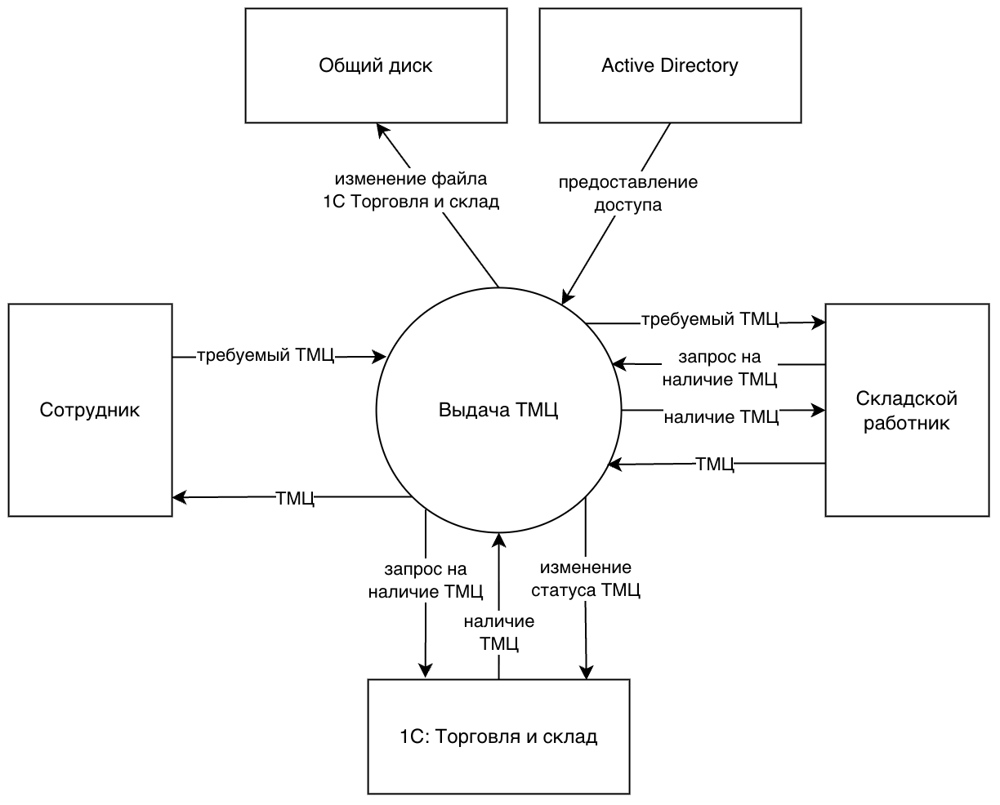

Процессинг платежей и выплата налогов
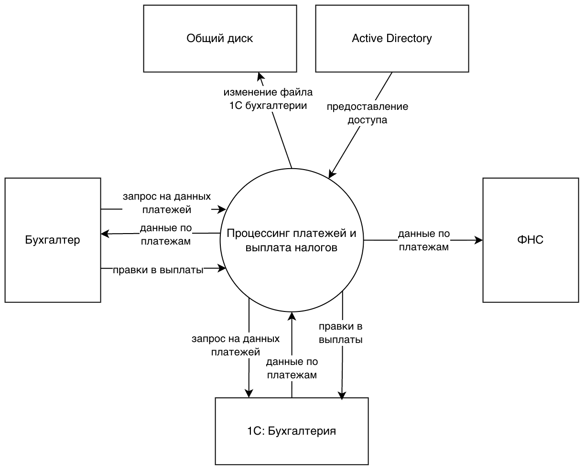

## Пункт 2

Найденные проблемы:
- [Privacy by Design / Least privilege] Перс. данные пациентов (Ф. И. О., дата рождения, паспорт, договор), медицинские данные (Диагнозы и другие сведения о здоровье) и внутренние данные компании лежат в файлах на общем диске без контроля доступа — при утечке возможны крупные потери репутации и штрафы, также возможна подмена данных.
    - Нет ограничения доступа к файлам, все могут посмотреть все
    - Не используются журналы входа и технические следы (IP, события доступа) — потенциальную атаку проще скрыть
- [Data Lineage] Платёжные данные дублируются в Excel и в 1С — риск расхождений в учёте.
- [Data Minimization] Количество запрашиваемых данных больше, чем нужно для работы 
- [Privacy by Design] Одновременное редактирование Excel файла может привести к потерям данным
- [Privacy by Design] Нет шифрования данных на сервере - есть опасность физической кражи данных

Еще есть проблемы, что только один сервер, но это больше проблемы масштабирования.

## Пункт 3

### Данные и способы защиты

Персональные данные пациента (Ф. И. О., дата рождения, паспорт, телефон, email, адрес)
- Шифрование: на уровне БД, шифрование дисков, зашифрованное объектное хранилище, TLS при передаче
- Обфускация в интерфейсах - не показываем полные данные без явного запроса, логируем запрос
- Токенизация в аналитической базе

Медицинские данные (мед.карты, диагнозы, анализы)
- Шифрование: на уровне БД, шифрование дисков, зашифрованное объектное хранилище, TLS при передаче
- Обфускация в интерфейсах - не показываем данные без явного запроса, логируем запрос
- Обфускация при обменах: обмен с лабораторией по номеру заказа, а не по ПДн
- Обезличивание: аналитический слой только на обезличенных или псевдонимизированных наборах

Записи на приём (пациент, врач, время, статус)
- Шифрование: на уровне БД, TLS при передаче
- Обезличивание: аналитический слой только на обезличенных или псевдонимизированных наборах

Платёжные данные (сумма, услуга, чек, связь с пациентом)
- Шифрование: на уровне БД, отдельный канал к 1С (mTLS), неизменяемые факты оплаты
- 1C клиент-серверный, а не файловый. Ограничение доступа к данным определенному кругу лиц
- Обфускация: в чеках — привязка по идентификатору заказа, а не ПДн
- Обезличивание: финансовая отчётность по услугам и периодам без персональных атрибутов

Данные сотрудников (кадры, зарплата, больничные)
- Шифрование: Данные лежат на отдельном контуре отдельный HR-контур, шифрование диска, TLS при передаче
- Доступ только выделенному списку лиц
- Обфускация: маскирование зарплаты, реквизитов в UI. Не показываем детальные личные данные, если не требуется.
- Обезличивание: агрегированные HR-отчёты

Учётные данные и секреты (AD, токены API, ключи интеграций)
- Шифрование: Vault, без секретов в коде и конфигах на диске, TLS при передаче
- Обфускация: не выводить в логи и интерфейсы

ТМЦ и коммерческие данные (остатки, закупки, P&L)
- Шифрование: на уровне БД, TLS при передаче
- 1C клиент-серверный, а не файловый. Ограничение доступа к данным определенному кругу лиц
- Обезличивание: в открытых отчетах без конфиденциальных данных (типа контактов поставщиков)

Технические журналы (IP, события входа, аудит)
- Шифрование: неизменяемое хранилище логов, шифрование БД
- Обфускация: запрет ПДн в логах по умолчанию, маскирование при выявлении

### Механизм тегирования

Теги по категориям:
- PII — Ф. И. О., дата рождения, телефон, email, адрес, паспорт в договоре
- PHI — диагнозы, медкарты, протокол приёма, результаты анализов
- Финансовые данные — оплаты, привязка услуги к сумме
- Учётные данные
- Технические данные - логи
- Коммерческие данные - контакты поставщиков, размеры закупок и прочее
- Кадровые данные - зарплата, больничные и др.

Дополнительно можно помечать этап обработки: сырые данные, обработанные, аналитические

После присвоения тега на данные навешиваются правила:
Доступ (RBAC/ABAC):
- PII — ресепшен и врачи для записи/контактов; полный профиль — по роли и цели обработки
- PHI — только лечебный контур; просмотр чужой карты без основания — запрет
- Финансовые и кадровые — отдельные роли, без доступа «всем сотрудникам»
- Коммерчечкие данные — отдельные роли, без доступа «всем сотрудникам»
- Учётные — ИБ и администрирование
- Технические логи — ИБ и администрирование

Защита:
- PII, PHI, финансовые, кадровые — шифрование при хранении и TLS при передаче; в интерфейсе — маскирование, где не нужен полный объём поля.
- Учётные данные — только в Vault; в логи и скриншоты не попадают.

Жизненный цикл и потоки:
- По тегу задаётся срок хранения (медкарты PHI — архив; сырые технические логи — удаление после N дней).
- Тег этапа «аналитические» — данные можно класть только в обезличенную витрину; 
- Тег этапа «сырые» — нельзя отдавать в отчёты без обработки.
- Для предотвращения утечек выгрузку данных с тегами PII/PHI/финансовые на общий диск или в почту блокировать или требовать согласование.

### План внедрения и инструменты:

Стек инструментов: 
1. Корпоративный Active Directory - регулирует доступ к файлам и рабочим станциям
2. Microsoft Purview - отвечает за обнаружение и классификацию данных по подключённым источникам (файловый сервер и почта)
3. HashiCorp Vault - хранит секретики
4. Keycloak (OIDC) поверх AD - для новых API

Кто что делает:
1. Сканирование и классификация — выполняют сканеры Purview по файловому серверу, почте и общим папкам с Excel. Автоматически присваивают тег(PII/PHI/финансовые) по правилам и словарям + ручная доразметка 1С
2. Политика тегирования — определяем регламент: кто подтверждает метку, что делать с новым полем в системе. Прописываем метки чувствительности на договорах и вложениях в Outlook через политики Purview
3. Доступ по тегам — разделяем группы AD по ролям (ресепшен, врач, бухгалтерия, HR, ИБ); для API — Keycloak + RBAC; при необходимости ABAC по цели (лечение, оплата, отчётность); в БД — роли на уровне схем/таблиц
4. Каталог и контроль — Purview хранит карту данных: что где лежит, какой тег стоит, как течёт между сервером, почтой и будущими БД. Периодически проверяем «дыры» без тегов и гоняем скан заново после миграций
5. Обучение — обучаем сотрудников (ресепшен, врачей и бухгалтерию) не выгружать размеченные данные на общий диск, что будет при триггере детекта утечек(DLP) при нарушении
6. Обновление тегов при смене источников — когда будем уходить от Excel, переводить 1С в клиент-сервер, подключать лабораторию и банк, нужно будет добавить источник в Purview, обновить Data Flow Diagram и политики
7. Согласие на обработку данных - на первом этапе ведём в учётной системе клиники в виде сканов. При росте количества запросов и интеграций можем добавить OneTrust.

#### Инструменты и изменений в потоках данных
Во всех To-Be процессах:
- шифруем трафик TLS
- доступ режем через группы AD (и Keycloak для новых API), сейчас на общем диске «видят все»
- Microsoft Purview занимается классификацией и выставлением меткок чувствительности на файлах/вложениях. DLP блокирует при необходимости выгрузки PII/PHI/финансов/кадровых данных в почту и на общий диск
- HashiCorp Vault хранит секреты интеграций (ключи API платёжного шлюза, сертификаты mTLS к 1С, учётные данные внешних каналов)

Заключение клиентского договора
- в форме оставляем минимум полей, следуем принципу Data Minimization
- договор и карточку не кладём на общий диск и не живём в Outlook как единственное хранилище, потому что там нет нормального контроля доступа и аудита
- на вложения в почте ставим метки чувствительности через Purview, потому что договоры уходят письмами и их легко переслать не туда
- согласие фиксируем (пока сканы в учётной системе), потому что без цели и согласия обработка ПДн по 152-ФЗ слабо обоснована

Запись пациента к специалисту
- запись создаёт только сотрудник ресепшена (или врач для своего журнала) в системе, а не в общем Excel — без самозаписи через ЛК и без SMS/пушей в этом процессе
- логируем кто создал и открыл запись, потому что без аудита утечку журнала не расследовать
- секреты доступа к API расписания (если появятся) — в Vault; выгрузку журнала на диск/в почту ограничивает Purview DLP

Журнал записей у ресепшена / врача
- журнал открываем по роли и филиалу, потому что не каждому сотруднику нужны все пациенты клиники
- при смене статуса пишем кто и когда изменил, потому что иначе споры и подмены не отличить от ошибки Excel
- врачу отдаём расписание с id пациента и слотом, для графика не нужна медкарта (PHI)
- экспорт журнала с PII контролируем через Purview DLP

Оплата за медицинские услуги
- оплату храним в одном месте (БД + 1С), а не ещё копией в Excel, потому что дубли могут расхойтись
- в 1С ходим по защищённому каналу (mTLS), сертификаты канала — в Vault
- в чеке и в событиях для учёта указываем id заказа, а не ФИО и диагноз, т.к. они не нужны для проводки
- карту клиента не храним у себя — только токен от платёжного шлюза; ключи шлюза — в Vault
- выгрузки платёжных реестров на общий диск/в почту блокируем через Purview DLP

Приём пациента
- медкарту держим в БД с шифрованием полей, а не в файлах на диске, потому что сейчас PHI на общем ресурсе
- карту открывает только лечащий контур, чтобы всем подряд врачам не отдавать
- каждое чтение карты пишем в аудит
- выгрузку PHI (сканы, выписки) на общий диск/в почту блокируем через Purview DLP

Учёт ТМЦ
- 1С переводим в клиент-сервер с ролями, потому что файловый режим и общие папки плохо масштабируются и плохо разграничиваются
- с бухгалтерией не гоняем ручные выгрузки на общий диск, потому что туда же уходят и чужие конфиденциальные файлы; такие выгрузки ограничивает Purview DLP
- руководству отдаём агрегаты, а не сырые таблицы с контактами поставщиков, потому что коммерческие данные не всем нужны
- учётные данные подключения к 1С — в Vault

Процессинг, налоги и кадры
- зарплату и больничные держим в HR-контуре отдельно от медицины, чтобы не смешивать кадровые и медицинские данные и не увеличивать ущерб при утечке
- в интерфейсе маскируем суммы зарплаты, т.к. не всегда нужна полная цифра, а ее может видеть посторонний
- выгрузки в банк и в госорганы — по регламенту и по защищённым каналам, потому что это массовые финансовые и ПДн сотрудников; секреты каналов — в Vault, копирование кадровых/финансовых выгрузок на общий диск — Purview DLP
- бэкапы 1С шифруем, потому что в них те же кадровые и платёжные данные, что и в проде

### Доработанные диаграммы потоков (To-Be)

Заключение клиентского договора
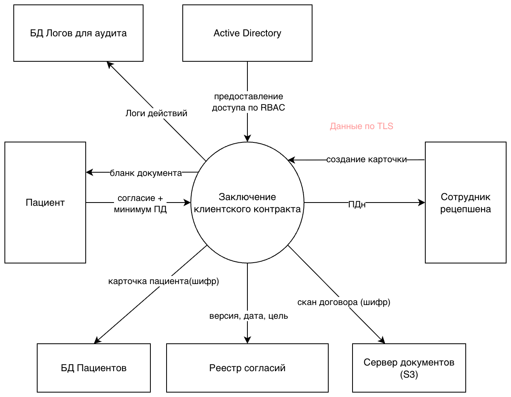

Запись пациента к специалисту
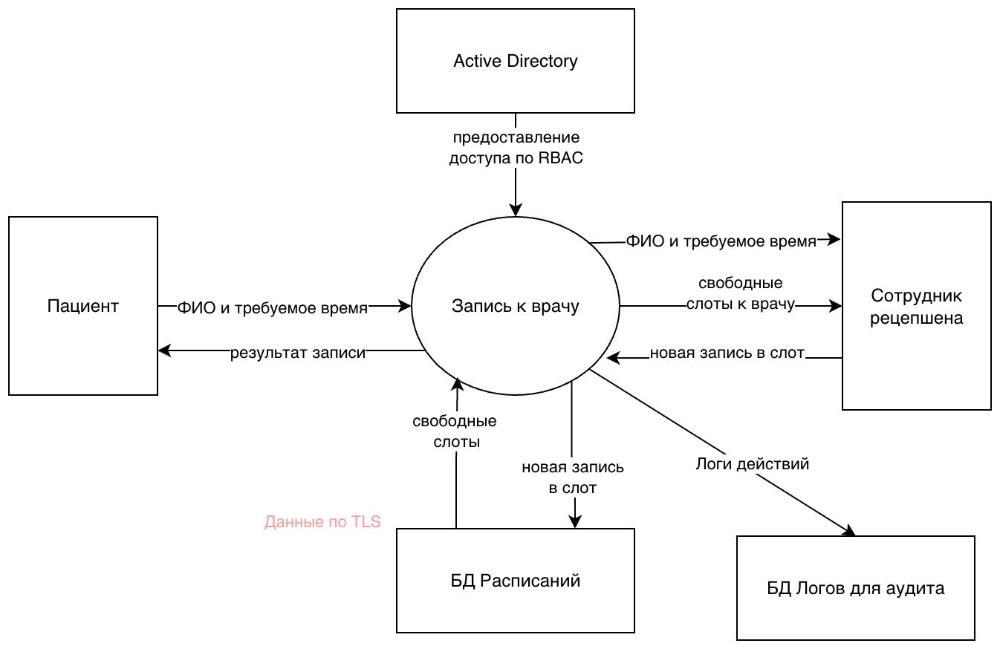

Просмотр и редактирование журнала записей к специалисту
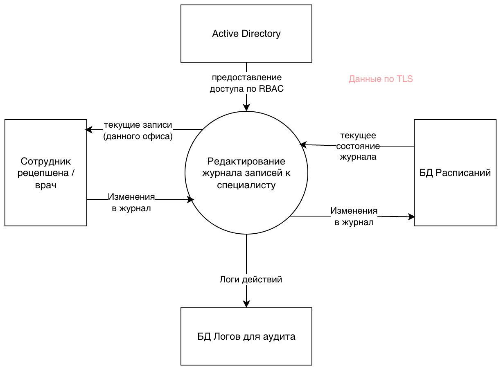

Оплата за медицинские услуги
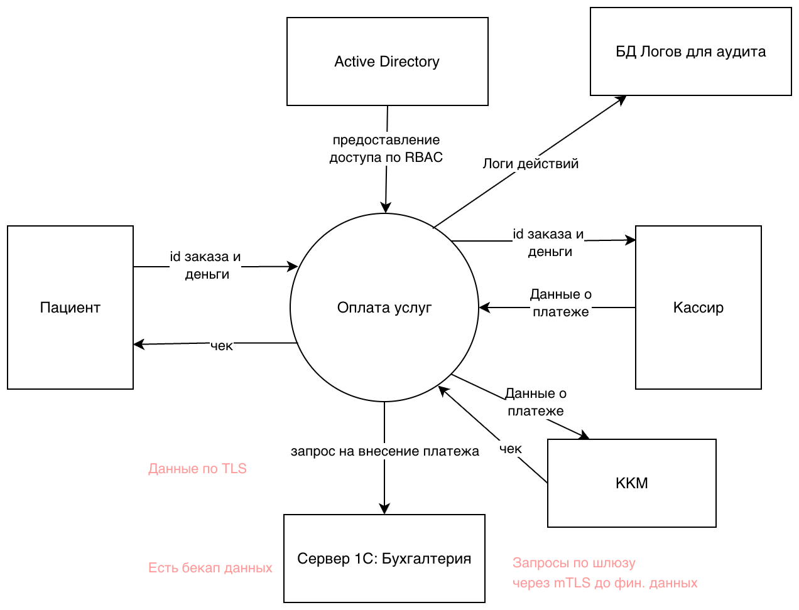

Прием пациента
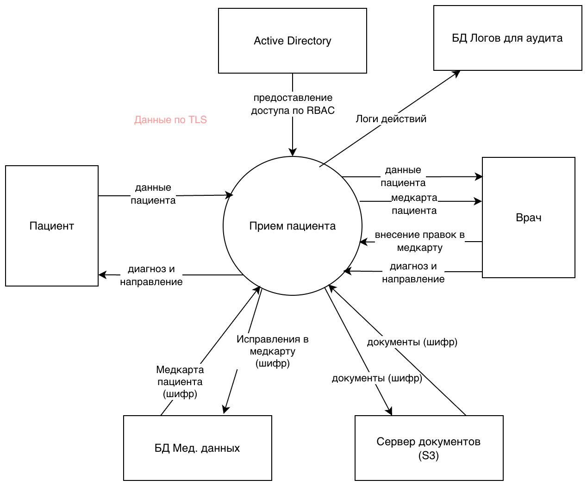

Учет ТМЦ
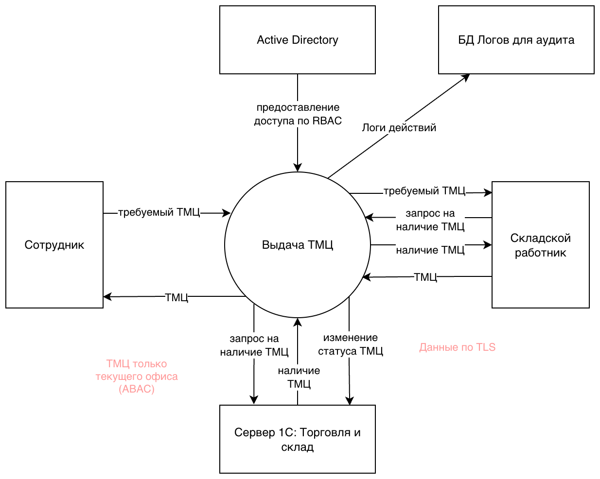

Процессинг платежей и выплата налогов
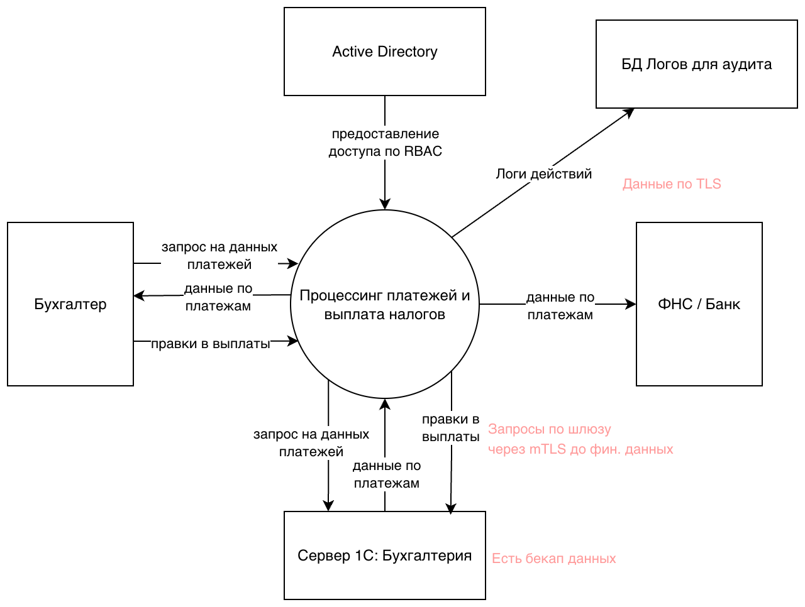
