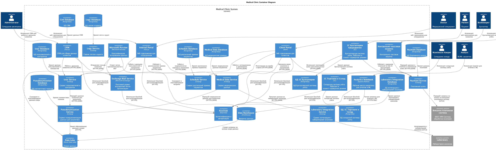

# Задание

Используя подход Privacy by Design, проведите анализ и предложите механизмы для предупреждения возможных рисков, связанных с конфиденциальностью. Ваша задача — спроектировать механизмы управления такими рисками до момента реализации изменений в проектируемой системе.

В рамках этого задания вам нужно проанализировать состояние As-Is и оценить, как спроектировать решение с учётом требований To-Be.

## Что нужно сделать

1. Предложить новые блоки в архитектуру проектируемой системе С4, которые обеспечат соблюдение принципов Privacy By Design во многих блоках реализуемой системы.
2. Предложить в целевой архитектуре слой, который обеспечивает аналитическую работу с данными системы с учётом принципов Privacy by Design.

Когда задание будет готово, загрузите диаграмму контекста C4 целевого состояния системы в директорию Task2 в рамках пул-реквеста.

# Решение

Принципы Privacy By Design гласят: 

  
Посмотреть 7 принципов

  
1. Быть проактивным, а не только устраненять последствия
2. Конфиденциальность по умолчанию
    - Минимизация данных
    - Настройки по умолчанию благоприятны для конфиденциальности
    - Необходимо требовать явное согласие пользователя перед сбором или обработкой персональных данных
3. Конфиденциальность, заложенная в дизайн
    - Методы шифрования, анонимизации и псевдонимизации в процессах обработки данных
    - Использование архитектурных паттернов, поддерживающих конфиденциальность (например, безопасных потоков данных и модульной архитектуры)
    - Управление жизненным циклом — учёт влияния конфиденциальности на всех этапах жизненного цикла системы, от разработки до вывода из эксплуатации
4. Полная функциональность без компромиссов по безопасности или удобства использования
5. Комплексная безопасность 
    - Безопасное хранение — использование шифрования и контроля доступа для данных, хранящихся на серверах и в базах данных.
    - Безопасная передача — внедрение безопасных протоколов связи (например, TLS/SSL) для данных, находящихся в пути.
    - Утилизация данных — разработка процедур безопасного удаления или анонимизации данных, которые больше не нужны.
6. Наглядность и прозрачность
    - Публикация чётких и доступных политик конфиденциальности
    - Предоставление пользователям доступа к их данным и возможности управлять настройками конфиденциальности
    - Введение процессов протоколирования и мониторинга для проведения аудита практики обработки данных
7. Уважение к конфиденциальности пользователей
    - Механизмы согласия — получение информированного согласия пользователей перед сбором или обработкой их данных.
    - Удобный для пользователя дизайн — разработка интерфейсов, облегчающих пользователям понимание и управление настройками конфиденциальности.
    - Отзывчивая поддержка — каналы для пользователей, по которым они могут задавать вопросы или высказывать опасения по поводу своей конфиденциальности

На архитектуре C4 можно отразить:
1. Отдельные сервисов ответственных за свои блоки данных вместо Excel файлов
    - Сервис записей
    - Сервис медицинских данных
    - Сервис интеграции с лабораторией анализов
    - Сервис пользователей и контрактов (регистрация, соглаcия обработки данных)
    - Платежный шлюз
2. Веб клиенты
    - Портал для клиентов
    - Портал для сотрудников сервиса
    - CRM для сбора данных клиентов
2. Методы безопасной передачи данных(HTTPS, mTLS)
3. Сервис для работы с аутентификацией и авторизацией(RBAC и ABAC)
4. Классификация, тегирование данных через Microsoft Purview и специальный сервис для псевдононимизации данных для аналитического контура
5. Сервис логов и аудита

На схеме не буду цеплять сервис логов ко всем сервисам, но буду подразумевать, чтобы уменьшить количество стрелок на схеме. 
Решил схему сделать в PlantUML, т.к. писать проще, чем кидать визуально + изменений от текущей схемы не мало. 
Визуально правда слабо читаемо получилось (прошу прощения).

Полученная архитектура: 
