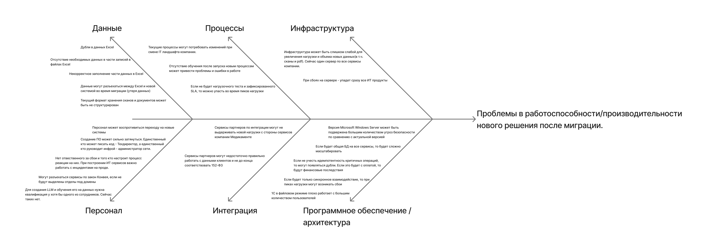

# Задание

В компании планируется миграция устаревшей монолитной системы на современную архитектуру (например, на микросервисную). В процессе перехода необходимо выявить потенциально узкие места, которые могут негативно повлиять на работоспособность нового решения.

## Что нужно сделать

1. **Проанализировать ситуацию.**
    - Изучить описание текущей системы и целей миграции.
    - Определить ключевые процессы и компоненты, затрагиваемые миграцией (например, базы данных, коммуникационные каналы, серверное оборудование, бизнес-логика).
2. **Построить диаграмму Исикавы.**
    
    Построить диаграмму «Рыбья кость» (Ishikawa) для выявления потенциальных причин узких мест.
    
3. **Выделить основные категории и для каждой указать возможные проблемы.**
    
    Например, «Инфраструктура», «Программное обеспечение», «Интеграция», «Персонал», «Процессы».
    
4. **Предложить рекомендации.**
    - Составить краткий список мер по устранению выявленных узких мест на основе диаграммы.
    - Оценить приоритетность этих мер.
5. **Сформировать отчёт.**
    - Представить диаграмму Исикавы (draw.io).
    - Описать выявленные проблемы и предложенные решения в виде отчёта. Ревьюер будет смотреть на системность и глубину проработки возможных рисков снижения производительности системы.

Когда задание будет готово, загрузите диаграмму Исикавы в draw.io в директорию Task4 в рамках пул-реквеста.

# Решение

Цели бизнеса: 
- Интеграция лаборатории анализов с API
    - Требования по безопасности полученной интеграции
- Расширение направления обработки данных (новые сервисы на базе BI-, ML- и AI-технологий)
    - Повышение удобства обработки данных и уменьшение ручной работы
- Разработка новых систем и миграция
    - Необходима для автоматизации процессов

Компоненты затрагиваемые миграцией:
- Способ хранения: уход от Excel
- Способ обработки данных: Переход на автоматизацию с ручной обработки данных
- Добавление мобильного проиложения, веб порталов и уведомлений
- Ограничение доступа к данным: Ввод RBAC и ABAC
- Добавление аудита и маркировки данных

Основная проблема описываемая в задании: Проблемы в работоспособности/производительности нового решения после миграции.
Ребра диаграммы должны показывать категории проблем работоспособности с которыми мы можем столкнуться.

Разбивка по категориям: 
- Инфраструктура
    - Инфраструктура может быть слишком слабой для увеличения нагрузки и объема новых данных(в т.ч. сканы и pdf). Сейчас один сервер по все сервисы компании.
    - При сбоях на сервере - упадет сразу все ИТ продукты
- Программное обеспечение / архитектура
    - Версия Microsoft Windows Server может быть подвержена большим количеством угроз безопасности по сравнению с актуальной версией
    - Если будет общая БД на все сервисы, то будет сложно масштабировать
    - Если не учесть идемпотентность критичных операций, то могут появляться дубли. Если это будет с оплатой, то будут финансовые последствия
    - Если будет только синхронное взаимодействие, то при пиках нагрузки могут возникать сбои
    - 1С в файловом режиме плохо работает с большим количеством пользователей
- Интеграция
    - Сервисы партнеров по интеграции могут не выдерживать новой нагрузки с стороны сервисов компании Медикаменте
    - Сервисы партнеров могут недостаточно правильно работать с данными клиентов и не до конца соответствовать 152-ФЗ
- Персонал
    - Персонал может воспротивиться переходу на новые системы
    - Создание ПО может сильно затянуться. Единственный кто может писать код - Техдиректор, а единственный кто руководит инфрой - администратор сети. 
    - Нет отвественного за сбои и того кто настроит процесс реакции на них. При построении ИТ сервисов важно работать с инцидентами на проде. 
    - Могут разъехаться сервисы по закон Конвея, если не будут выделены отделы под домены
    - Для создания LLM и обучения его на данных нужна квалификация у хотя бы одного из сотрудников. Сейчас таких нет.
- Процессы
    - Текущие процессы могут потребовать изменений при смене IT ландшафта компании. 
    - Отсутствие обучения после запуска новым процессам может привести проблемы и ошибки в работе
    - Если не будет нагрузочного теста и зафиксированного SLA, то можно упасть во время пиков нагрузки
- Данные
    - Дубли в данных Excel
    - Отсутствие необходимых данных в части записей в файлах Excel
    - Некорректное заполнение части данных в Excel
    - Данные могут разъехаться между Excel и новой системой во время миграции (утеря данных)
    - Текущий формат хранения сканов и документов может быть не структурирован

Полученная диграмма Исикавы:

Решения проблем:
1. Инфраструктура должна быть масштабируемая и для быстрой обработки новых нагрузок можно перевести его в облако, котороее соотвествует 152-ФЗ и аттестовано на работу с чувствительными данными, либо закупить сервера и обеспечить их независимость, чтобы уменьшить шанс падения сразу обоих. Нужно расчитать объем данных и запросов и заложить дополнительно на рост нагрузки и данных. 
2. Необходимо обновить все ПО серверов и поддерживать на актуальной LTS версии. 
3. Каждый микросервис должен иметь свою БД и для БД с чувствительными данными должны выставляться более строгие требования.
4. При формировании взаимодействия между сервисами компании и сервисами партнеров нужно учитывать возможность сетевых проблем и проблем с нагрузкой и стараться, где это возможно использовать асинхронное взаимодействие, а при синхронном использовать таймауты и circuit breaker. При работе с важными данными использовать outbox и идемпотентность обработки.
5. 1С перевести в клиент-серверный режим.
6. При работе с партнерами стоит выбирать тех, что соотвествуют 152-ФЗ и выставлять такие требования в договоре. Дополнительно прописывать SLA работы, чтобы уменьшить финансовые последствия. 
7. Перед началом разработки необходимо определить недостающих сотрудников и провести их найм. 
8. Для каждого домена выделить свой отдел и свой сервис, чтобы ИТ ландшафт изначально соотвествовал кадровой структуре.
9. Для работы с инцидентами на проде важно выделить отдельную роль и при разработке описать способы отслеживания инцидентов, настроить наблюдаемость, описать runbook'и и процесс работы с исправлением корневых проблем возникновения инцидентов. Дополнительно ввести процесс нагрузочных тестирований и выработать SLA сервисов для понимания текущего соответствия сервисов требуемой производительности. 
10. При переходе на новые сервисы необходимо коммуницировать с персоналом и объяснить причины изменений, выслушать комментарии и адаптировать решение, если требуется.
11. При переходе на новые сервисы необходимо провести обучение новым процессам работы
12. Параллельно с разработкой новых сервисов нужно вести работу по уменьшению расхождений и ошибок в текущих данных в Excel и систематизация хранения других документов(сканы, pdf). 
13. При проектировании новых сервисов нужно учесть механизм миграции со старого источника правды на новый и продумать механизм rollback'a, если новая система приведет к ошибкам. 