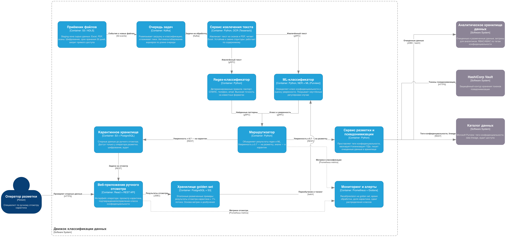

# Задание

Ваша задача — добавить движок для классификации данных перед их загрузкой в хранилище. Для этого предложите в целевой архитектуре слой, который обеспечивает аналитическую работу с данными системы с учётом принципов Privacy by Design.

### **Что нужно сделать**

1. Спроектируйте движок для классификации данных перед их пакетной загрузкой в аналитическое хранилище данных. При проектировании не забудьте учесть, что структуры данных на входе в хранилище подвержены структурным изменениям и не размечены на предмет того, к какому классу конфиденциальности относятся.
2. В хранилище данных тем не менее будут частично храниться данные, которые можно отнести к конфиденциальным. Поэтому необходимо предложить проектное решение по организации специального слоя/нескольких слоёв в хранилище данных, учитывающее эту особенность. Обратите внимание, кроме слоёв можно предложить и другие меры.
3. Ответить на вопросы, какие метрики вы будете использовать для оценки эффективности классификации данных и как это поможет в процессе оптимизации системы.
4. Подумать о том, как будет обеспечена scalability системы и как вы планируете расширить систему при увеличении объёма данных или количества пользователей.

Загрузите диаграмму C2 решения — движка, реализующего задачу классификации данных перед загрузкой их в хранилище в директорию Task6 в рамках пул-реквеста.

# Решение

## Варианты классификации
Среди данных мы имеем:
- Excel документы
- Сканы
- PDF

Какие есть варианты как классифицировать:
- По именам колонок в Excel. Не будет работать, если поменять название колонки
- По местоположению (сканы, pdf). Не будет работать при смене папки (или для новой папки)
- По содержимому текста - написать регулярки(напр. почта, паспорт, номер телефона). Не сработает для неучтенного текста
- Машинное обучение через Purview

Вероятно можно выстроить через применение регулярок и ML, а при низкой уверенности у ML отправлять данные на ручную проверку, чтобы случайно не пропустить чувствительные данные. 

## Организация слоев в хранилище данных

Базово можно предусмотреть слои по степени обработанности:
- Сырые
- Очищенные и размеченные (ПДн тут заменены)
- Витрины данных для отчетов (тут работает аналитик)

Дополнительно:
- Срок хранения сырых данных ограничиваем 
- Для сырых данных ставим запрет на доступ
- Настраиваем шифрование сырых данных
- На очищенные данные даем доступ только при необходимости и желательно на время. 
- Настраиваем аудит доступа к данным
- Токены для псевдонимизации храним отдельно в защищенном контуре (напр. Vault).
- Результат классификации сохраняем как тег класса конфиденциальности в каталоге данных (Purview): он даёт основу для политик доступа и аудита.

## Метрики для оценки эффективности

Для оценки работы можно составить golden set с типовыми сценариями и прогонять на них работу системы для высчитывания 
- recall
- precision
- время работы - для понимания временных рамок процесса
- подсчет актуальной разбивки по процентам решений по данным (при резком изменении может говорить о смене схемы и неучтенных данных)

Низкие recall и precision должны говорить о потребности в смене алгоритма. Кроме того, метрики помогают в оптимизации: по времени работы подбираем размер батчей и параллелизм, по доле карантина видим, где дообучать ML и дописывать регулярки, по сдвигу распределения классов обнаруживаем дрейф схем источников.

Пополнение golden set будет происходить при ручном отсмотре карантина и 1% всех поступлений. Так мы сможем адаптироваться под изменения в реальных данных. 

## Расширяемость системы

Для адаптации объема данных можно шардировать хранилища данных.
Для адаптации к возросшей нагрузке можно масштабировать модули классификации. 
При росте числа пользователей масштабируем витрины (реплики на чтение) и вычислительные кластеры аналитиков.

Между загрузкой и классификацией ставим очередь: она развязывает этапы, сглаживает пики и позволяет автомасштабировать воркеры классификации по длине очереди.

Дополнительно можно рассмотреть вертикальное масштабирование как наиболее простой вариант масштабирования.

## Диаграмма работы классификатора

Таким образом классификатор будет работать следующим образом:
1. Ввод данных в хранилище сырых данных
2. OCR при сканах и PDF
3. Regex + ML (расчет уверенности)
4. Отправка в карантин при необходимости
5. Отсмотр специальным человеком для проверки работы системы
6. Передача в очищенные данные

Далее трансформация очищенных данных в витрины для аналитиков уже не входят в работу классификатора. 

